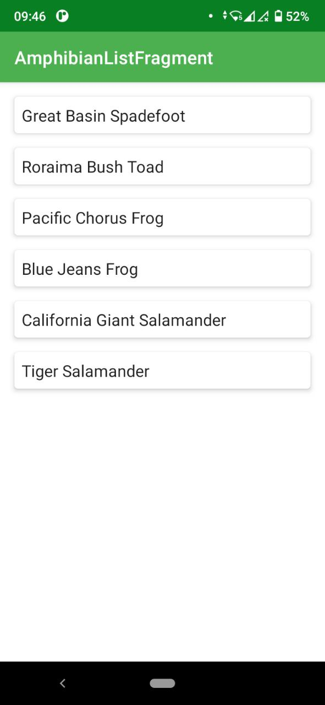
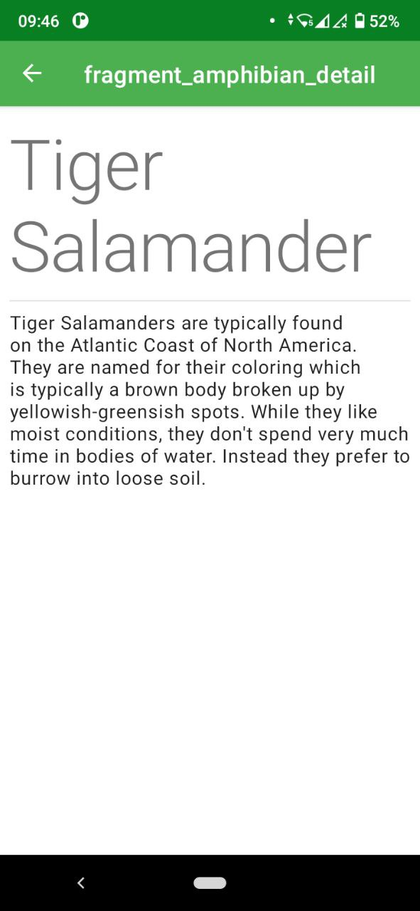

The app that displays information about different amphibian species, and use knowledge of networking, JSON parsing, and view models to enable the app to use data from the network.
The app will get its data from a custom API for this project and display it in a list view.

[Download application](apk/Amphibians.apk)

